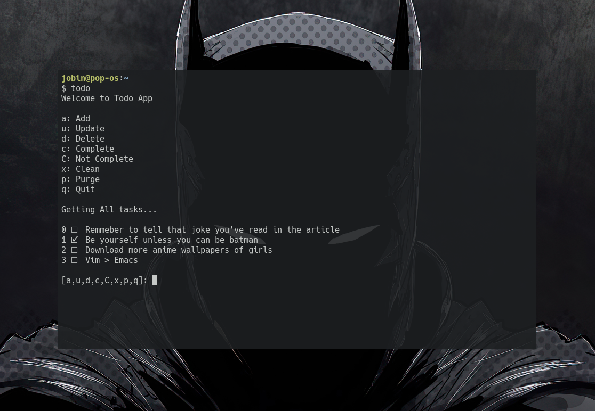

# Todo
A Basic todo command line app written in rust with minimal features for quickly writing down tasks when you are on the terminal

It caches all the tasks in `$HOME/.cache/todo_cli/todo.txt` for when you open **todo** the next time

## Install

1. Clone the repo to anywhere in your system 
    - `git clone --depth 1 https://github.com/Jobin-Nelson/todo.git`

3. cd into todo and Build the binary
    - `cargo build --release`

3. Move the binary to anywhere in your `$PATH` variable, for me it is `$HOME/script`
   - `mv target/release/todo ~/script/`

### Dependecies

- **crossterm**: *for reading raw input*